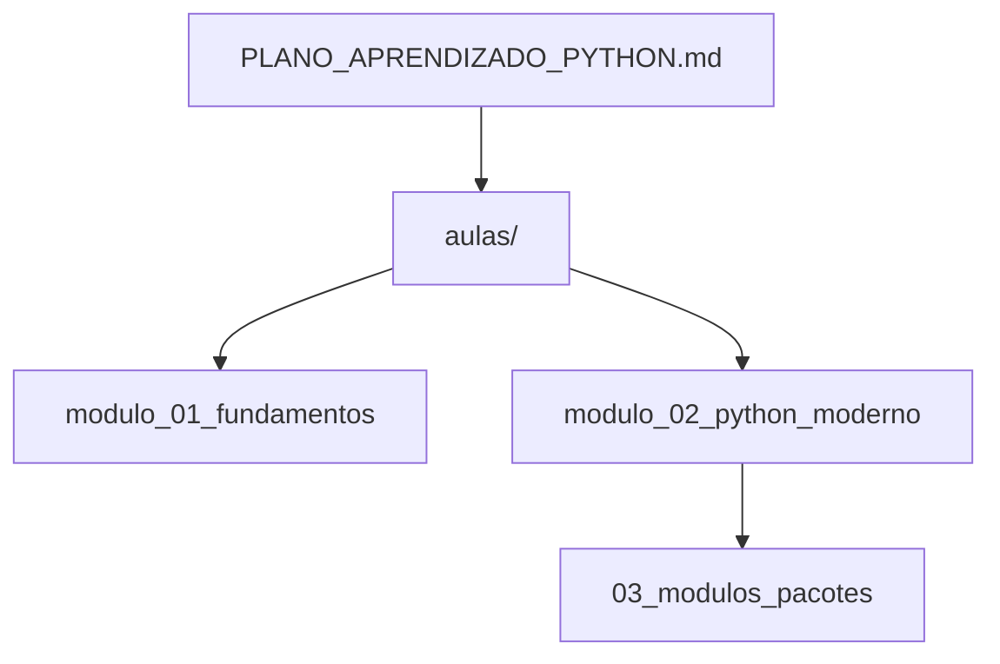

# BasicPy

Repositorio de estudo para o "Curso Intensivo de Python para Arquitetos .NET/C#".
Aqui ficam os scripts de aula, projetos de apoio e o plano de aprendizado.

## Visao geral
- Objetivo: aprender Python de forma pratica, comparando conceitos com C#.
- Material principal: `PLANO_APRENDIZADO_PYTHON.md`.
- Exercicios por modulo: `aulas/`.

## Estrutura de pastas
```
BasicPy/
├── PLANO_APRENDIZADO_PYTHON.md
├── aulas/
│   ├── modulo_01_fundamentos/
│   └── modulo_02_python_moderno/
│       └── 03_modulos_pacotes/ (projeto com pyproject.toml e src/)
└── .venv/ (opcional, se voce quiser um venv global)
```



## Como executar as aulas

### Scripts simples (aulas iniciais)
Exemplo:
```
python aulas/modulo_01_fundamentos/02_tipos/aula_1_2.py
```

### Projeto de modulos/pacotes
Esse projeto vive em:
`aulas/modulo_02_python_moderno/03_modulos_pacotes/`

Linux/macOS:
```
cd aulas/modulo_02_python_moderno/03_modulos_pacotes
python -m venv .venv
source .venv/bin/activate
python -m pip install -e .
python src/main.py
```

Windows (PowerShell):
```
cd aulas/modulo_02_python_moderno/03_modulos_pacotes
python -m venv .venv
.venv\Scripts\Activate.ps1
python -m pip install -e .
python src/main.py
```

## Convencoes
- Nome de arquivo: `aula_<modulo>_<numero>.py`.
- Cada modulo pode ter seu proprio `.venv` (recomendado para evitar conflitos).
- Projetos maiores ficam em `aulas/modulo_*/XX_nome/` com `pyproject.toml` e `src/`.

## Proximo passo
Continue seguindo o cronograma em `PLANO_APRENDIZADO_PYTHON.md`.
